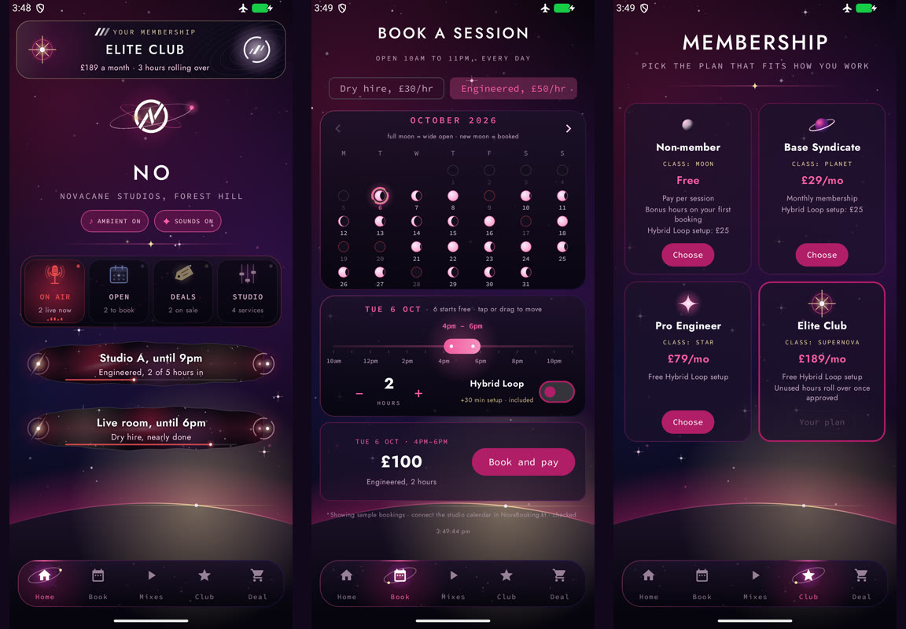
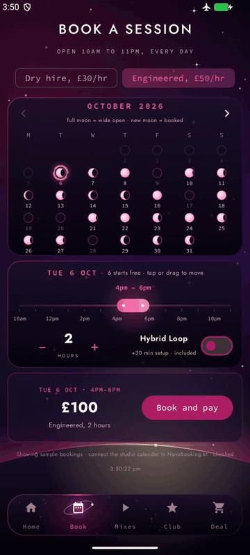
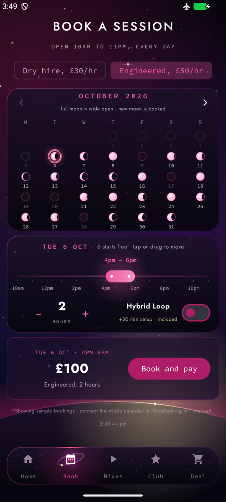
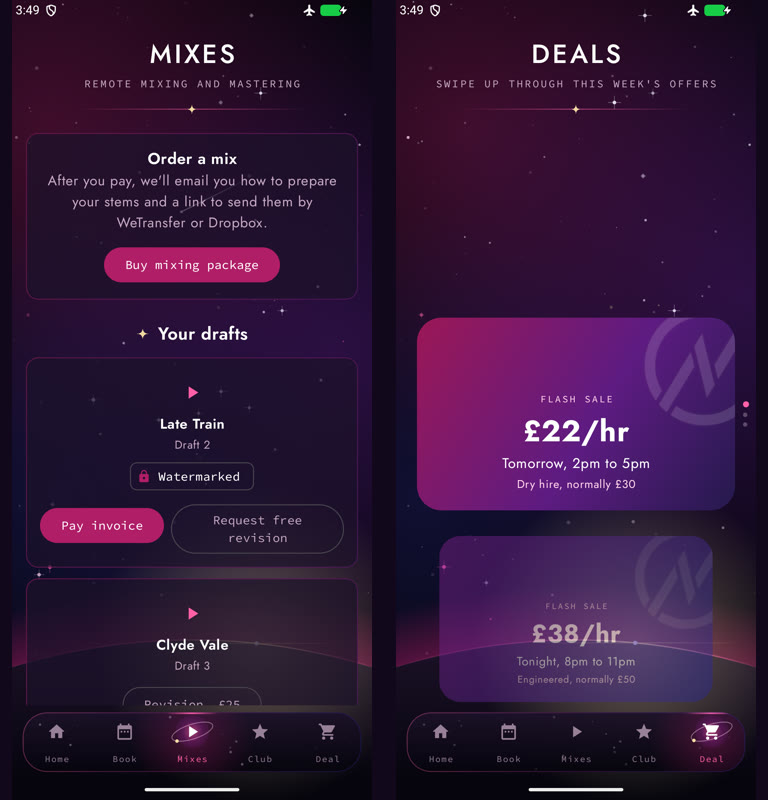
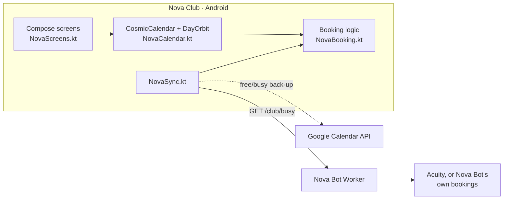

<div align="center">



# Nova Club

**A members' app for Novacane Studios, where every day is a moon.**

[](https://developer.android.com/compose)
[](https://m3.material.io)
[-3DDC84?logo=android&logoColor=white)](https://developer.android.com)
[](#tests)
[](https://github.com/tuniveza/nova-suite)

</div>

---

Nova Club is an Android app for the studio's members. Its booking calendar treats booking as
astronomy: a **full moon** means a day is wide open, a **crescent** means it's filling up, and
a **new moon** means it's fully booked. Each day opens as an orbit from 10am to 11pm, and you
drag your session along it. The calendar follows the studio's real bookings live, through
[Nova Bot](https://github.com/tuniveza/nova-bot)'s `/club/busy` feed, and celebrates on screen
when a booking lands or a time frees up.

> **Status:** an active prototype. The calendar, sync, membership screens, deals and sound
> are working; checkout isn't connected yet, so "Book and pay" re-checks the time and says
> so rather than taking a booking.

## What it does

- **CosmicCalendar** (`NovaCalendar.kt`): a month where each day is a moon, lit by how open it
  is for the session you've set up.
- **DayOrbit**: one day's opening hours as an orbit, with bookings as dark blocks, the Hybrid
  Loop setup time, and your session as a glowing bar you can tap or drag to a free time.
- **Session builder**: dry hire or engineered, hours, Hybrid Loop, and the price for your
  membership tier. Just before "Book and pay" it reads the calendar again, so it can't offer
  a time that's just been taken, and slides to the nearest free time if needed.
- **Live calendar sync** (`NovaSync.kt`, `NovaBooking.kt`): the studio's busy times from
  Nova Bot's Worker (no names, only times), with the studio's Google Calendar free/busy
  alongside as a back-up. It checks every second on the Book screen and every few seconds
  elsewhere, and remembers what it saw, so bookings made while the app was closed are
  celebrated when it opens.
- **Membership** (`NovaData.kt`): Non-member, Base Syndicate, Pro Engineer and Elite Club tiers,
  with a membership card and tier picker.
- **Deals and notifications** (`NovaNotifications.kt`): a flash-sale deal carousel and custom
  notifications.
- **Mixes**: order a mix and keep track of drafts and revisions.
- **Sound** (`NovaSound.kt`): a quiet ambient loop and soft effects for taps, switches and
  bookings, all generated from scratch by `tools/make_sounds.py`. Both can be turned off.
- **Works without any setup**: with no Worker address and no Google key, it shows built-in
  sample bookings.

## Screenshots

<table>
  <tr>
    <td width="40%" align="center"></td>
    <td width="60%" align="center"><br><sub>Book: the moon calendar, the day's orbit and the price.</sub></td>
  </tr>
</table>

<p align="center">
  <br>
  <sub>Mixes and Deals. All screenshots use the app's built-in sample bookings.</sub>
</p>

## How it works



- **`NovaBooking.kt`** is the calendar's brain: days in London time, studio hours, busy blocks
  and which sessions fit. It's plain Kotlin with no screen code, so it's unit-tested on its own.
- **Where bookings come from** (`availabilitySource()`): Nova Bot's Worker (with Google Calendar
  alongside) if `STUDIO_WORKER_URL` is set, otherwise Google Calendar on its own if it's set up,
  otherwise the sample bookings.
- **Privacy:** the Worker sends only times, never names. The Google calendar should be shared
  as "See only free/busy (hide details)".

## Run it locally

1. Open the folder in [Android Studio](https://developer.android.com/studio) and let Gradle
   sync, or build from the command line:

   ```sh
   ./gradlew :app:assembleDebug        # app/build/outputs/apk/debug/app-debug.apk
   ./gradlew :app:installDebug         # onto a connected phone or emulator
   ```

2. Run it on a phone or emulator with Android 7.0 (API 24) or newer.

It builds and runs with no keys at all.

## Configuration

Settings that belong to one machine live in **`local.properties`**, which git ignores. Android
Studio creates it with your SDK path; add any of these lines yourself:

```properties
# Optional: the Google Calendar API key used for the free/busy back-up.
# Restrict it to the Calendar API and this app's package and signing certificate.
novaclub.googleCalendarApiKey=YOUR_KEY
```

The key reaches the code as `BuildConfig.GOOGLE_CALENDAR_API_KEY` (see `app/build.gradle.kts`).
Leave it out and the app skips Google Calendar.

Other settings are constants at the top of `NovaBooking.kt`:

| Constant | What it's for |
|---|---|
| `STUDIO_WORKER_URL` | Nova Bot's Worker, which serves `/club/busy` (blank = Google Calendar only, or the sample bookings) |
| `GOOGLE_CALENDAR_ID` | The studio calendar's ID (shared as free/busy only) |
| `CALENDAR_SYNC_SECONDS`, `CALENDAR_SYNC_FAST_SECONDS`, `CALENDAR_SYNC_RETRY_SECONDS` | How often the calendar is checked |
| `GOOGLE_CALENDAR_REUSE_SECONDS` | How long a Google Calendar answer is reused |

Membership tiers, prices and sample data are in `NovaData.kt`.

**Release signing:** no keystore or signing config is committed. Keep your keystore and its
passwords outside the repository (or in an ignored `keystore.properties`).

## Tests

```sh
./gradlew :app:testDebugUnitTest
```

`BookingLogicTest.kt` (17 tests) covers the booking logic in `NovaBooking.kt`: which sessions
fit around bookings and the Hybrid Loop setup, start times and how open a day is, London time
and late sessions across midnight, spotting new bookings, cancellations and moves, and the
Worker winning over an older copy of Google Calendar.

## Project layout

```
app/src/main/java/uk/co/novacane/novaclub/
  MainActivity.kt        entry point: theme and notification channels
  NovaScreens.kt         the screens: Home, Book, Mixes, Club, Deals
  NovaCalendar.kt        CosmicCalendar and DayOrbit, drawn on canvases
  NovaBooking.kt         booking logic and the calendar sources (Worker, Google, sample)
  NovaSync.kt            keeping in step with the studio calendar, and the celebration
  NovaData.kt            membership tiers, deals and sample data
  NovaNotifications.kt   notification channels and custom notifications
  NovaEffects.kt         animations and cosmic effects
  NovaSound.kt           ambient loop and sound effects
  NovaTheme.kt           colours, fonts (Jost, Source Code Pro) and the Material 3 theme
app/src/main/res/raw/    the generated sounds (OGG)
app/src/test/            unit tests
tools/make_sounds.py     makes the sounds from scratch
docs/media/              README images
```

## Part of the Nova suite

| Project | What it is |
|---|---|
| [nova-suite](https://github.com/tuniveza/nova-suite) | The Nova suite: an overview of every project |
| [nova-bot](https://github.com/tuniveza/nova-bot) | The website chat assistant, booking card and Nova Hub; serves `/club/busy` |
| [nova-agent](https://github.com/tuniveza/nova-agent) | Browser helper that does jobs in Acuity's admin pages |
| **[nova-club](https://github.com/tuniveza/nova-club)** | This repo: the members' Android app |
| [nova-calendar](https://github.com/tuniveza/nova-calendar) | A cosmic calendar of note cards and day cards |
| [nova-notes](https://github.com/tuniveza/nova-notes) | Nova Notes (in progress) |
| [nova-observatory](https://github.com/tuniveza/nova-observatory) | A dashboard of every project, with screenshots and video |

## Licence

All rights reserved — Novacane Studios. The bundled Jost and Source Code Pro fonts keep their
own SIL Open Font Licence.
